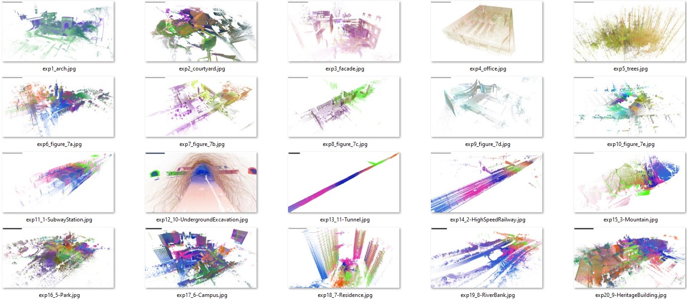
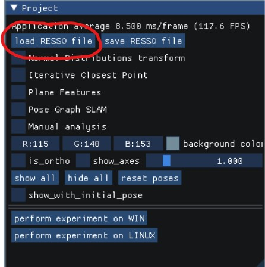
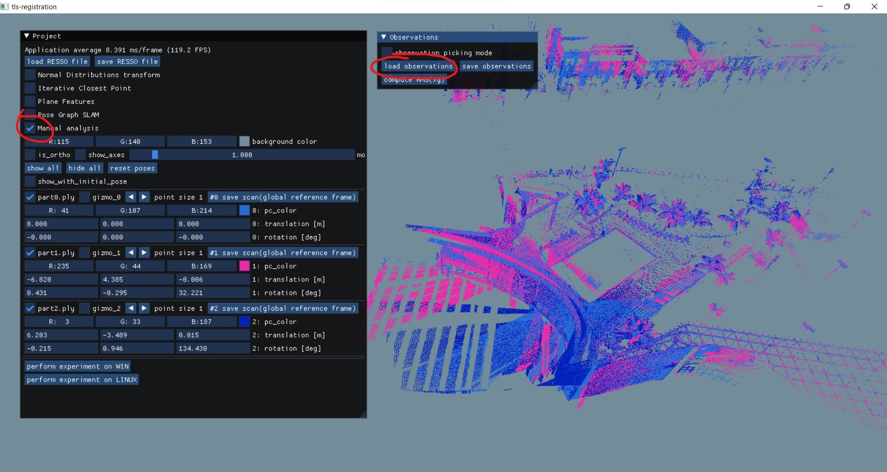
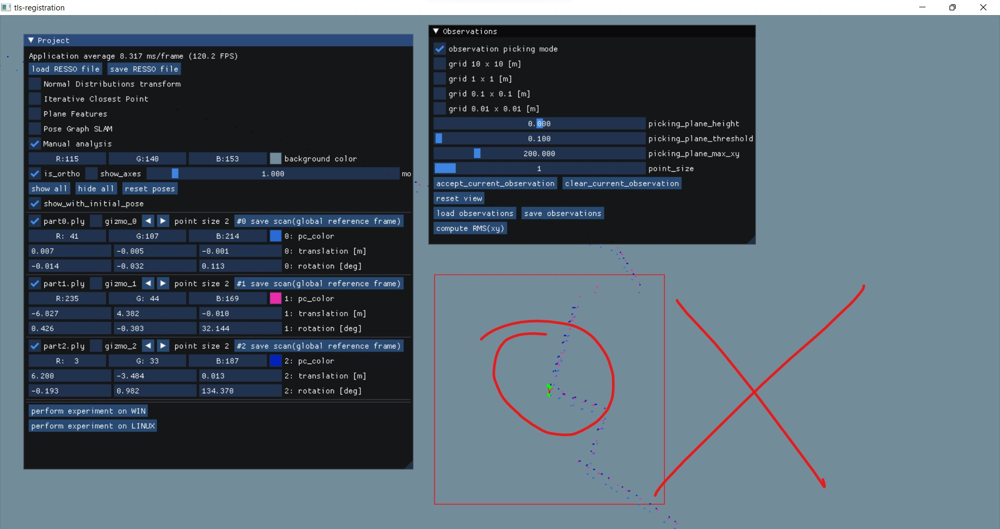
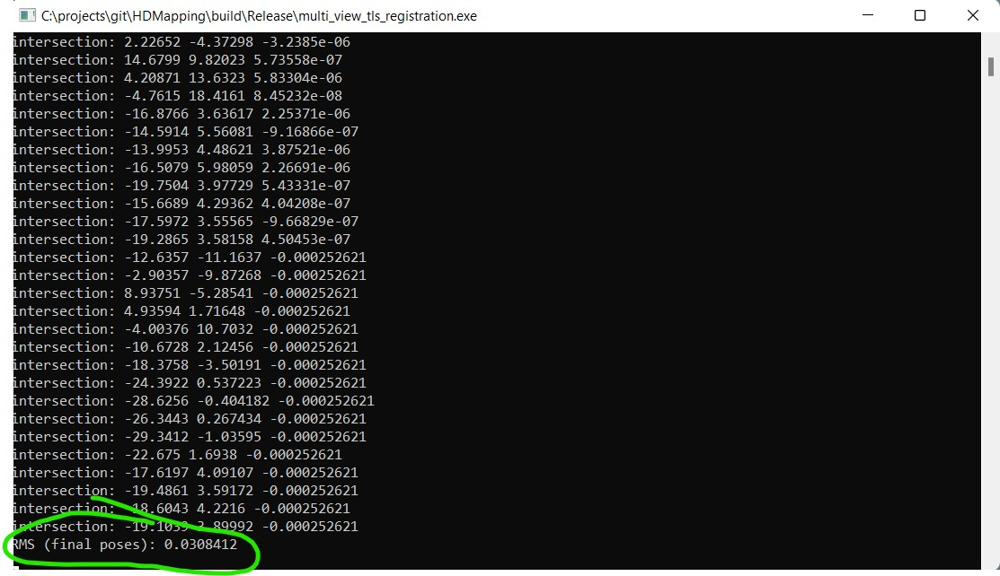

# TLS registration

Tested on following datasets:



Figure: Three publicly available data sets are incorporated into the benchmark.

First row: **ETH**, second row: **RESSO**, third and fourth rows: **WHU_TLS**.

```
ETH:
@article{THEILER2014149,
     title = {Keypoint-based 4-Points Congruent Sets – Automated marker-less registration of laser scans},
     journal = {ISPRS Journal of Photogrammetry and Remote Sensing},
     volume = {96},
     pages = {149-163},
     year = {2014},
     issn = {0924-2716},
     doi = {https://doi.org/10.1016/j.isprsjprs.2014.06.015},
     url = {https://www.sciencedirect.com/science/article/pii/S0924271614001701},
     author = {Pascal Willy Theiler and Jan Dirk Wegner and Konrad Schindler},
     keywords = {Point cloud registration, Terrestrial laser scanning, 3D keypoint extraction, Congruent point sets, Geometric matching},
}

RESSO:
@article{chen2017plade,    
     title = {PLADE: A Plane-based Descriptor for Point Cloud Registration with Small Overlap},    
     author = {Chen, Songlin and Nan, Liangliang and Xia, Renbo and Zhao, Jibin and Wonka, Peter},    
     booktitle = {IEEE Transactions on Geoscience and Remote Sensing}, 
     volume={58},
     number={4},
     pages={2530-2540},     
     year = {2020} 
}

WHU_TLS:
@article{DONG2020327,
     title = {Registration of large-scale terrestrial laser scanner point clouds: A review and benchmark},
     journal = {ISPRS Journal of Photogrammetry and Remote Sensing},
     volume = {163},
     pages = {327-342},
     year = {2020},
     issn = {0924-2716},
     doi = {https://doi.org/10.1016/j.isprsjprs.2020.03.013},
     url = {https://www.sciencedirect.com/science/article/pii/S0924271620300836},
     author = {Zhen Dong and Fuxun Liang and Bisheng Yang and Yusheng Xu and Yufu Zang and Jianping Li and Yuan Wang and Wenxia Dai and Hongchao Fan and Juha Hyyppä and Uwe Stilla},
     keywords = {Benchmark data set, Deep learning, Point cloud, Registration, Terrestrial laser scanning},
}
```

# Download app

Download *.exe and laszip3.dll from [Releases](https://github.com/MapsHD/HDMapping/releases)

# Running the app

Step 1: Load RESSO file reported by [1] as ground truth




Step 2: Choose manual analisys and load observations




Step 3: Choose observation picking mode and compute RMS


Step 4: Choose one from plenty of optimization variants 


Step 5: Check results before (initial pose) and after optimization




Step 6: Compute RMS




Step 7: Enjoy improved ground truth

[1] Songlin Chen, Liangliang Nan, Renbo Xia, Jibin Zhao, and Peter Wonka. Plade: A plane-based descriptor for point cloud registration with small overlap. 58(4):2530–2540, 2020.

